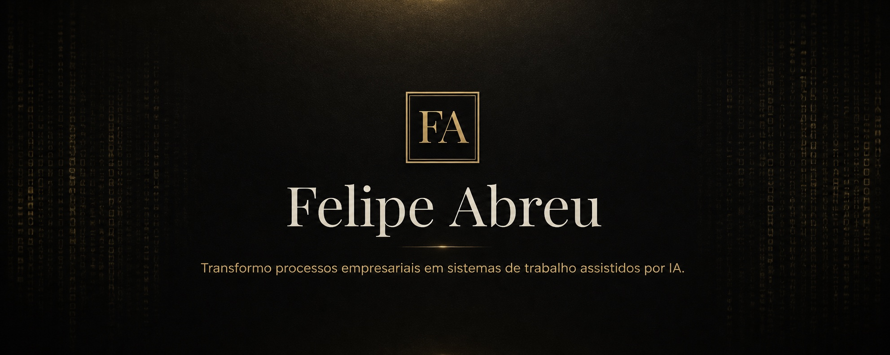

 

**Consultoria, arquitetura e implementação para fundadores e executivos.**

Atendimento em português e inglês · Available in Portuguese and English

[**Vamos conversar sobre o seu processo**](mailto:contato@mentordosnerds.com.br?subject=Conversa%20sobre%20sistema%20de%20IA) · [LinkedIn](https://www.linkedin.com/in/felipesla/)

---

## Sua empresa usa IA — ou apenas acumula ferramentas, prompts e automações?

Quando o resultado depende de contexto preso na cabeça de alguém, integrações difíceis de auditar e experimentos que não sobrevivem à rotina, ainda não existe uma operação assistida por IA.

Meu trabalho é transformar essa dispersão em um sistema: processos claros, contexto preservado, responsabilidades definidas, aprovações humanas e resultados que podem ser acompanhados.

Não vendo uma “IA mágica”. Combino visão empresarial e conhecimento técnico para identificar onde IA e automação podem gerar valor — e também implementar a solução, usando ferramentas de mercado ou arquitetura interna quando segurança, soberania e integração exigirem mais controle.

## O que eu construo

- **Sistemas de trabalho assistidos por IA** que coordenam pessoas, agentes, ferramentas e conhecimento em torno de um processo real.
- **Copilotos de diretoria e backoffices inteligentes** que reduzem troca de contexto e transformam intenção em trabalho verificável.
- **Bases de conhecimento vivas** que preservam decisões, evidências e continuidade operacional.
- **Automações técnicas e agentes especializados** com permissões explícitas, rastreabilidade e pontos de controle humano.

## Da oportunidade à operação

1. **Diagnóstico:** mapeamos o processo, o gargalo, os riscos e o resultado esperado.
2. **Prova controlada:** validamos uma hipótese em escopo pequeno, com baseline e critérios de sucesso.
3. **Implementação:** integramos a solução ao trabalho real, com documentação, governança e transferência de conhecimento.
4. **Operação assistida:** acompanhamos métricas, incidentes, permissões e novas oportunidades de expansão.

O objetivo não é automatizar tudo. É ampliar a capacidade da empresa sem perder direção, responsabilidade ou controle.

## A diferença não está apenas no modelo

Uma operação confiável precisa de mais do que acesso a uma boa IA:

- conversa como interface, sem transformar todo problema em um prompt;
- memória contextual e estado verificável entre decisões;
- especialistas e ferramentas coordenados por responsabilidade;
- permissões, evidências e trilhas de auditoria proporcionais ao risco;
- aprovação humana nos pontos em que julgamento e consequência importam;
- arquitetura sob controle do cliente, sem dependência artificial.

## Quem está por trás

Sou **Felipe Abreu**, fundador da [Mentor dos Nerds](https://github.com/mentordosnerds), profissional de tecnologia formado em Ciência da Computação pela UNISINOS, mentor e autor.

Trabalho na interseção entre arquitetura de software, automação com IA e liderança técnica, transformando complexidade em sistemas, decisões e rotinas mais claras. Minha base passa por software, dados, infraestrutura, segurança, open source, documentação e governança de engenharia — porque uma solução só se torna valiosa quando continua funcionando depois da demonstração.

## Trajetória no GitHub

Construo em público no GitHub desde 2010. Os troféus abaixo destacam apenas os indicadores com ranks altos ou raros; a atividade detalhada permanece disponível logo depois dos projetos.

## Engenharia aberta

Parte dessa base técnica vive em projetos públicos:

- [**Fast Forward Framework**](https://github.com/php-fast-forward/framework) — framework PHP leve para aplicações modernas.
- [**Fast Forward Dev Tools**](https://github.com/php-fast-forward/dev-tools) — ferramentas reutilizáveis para desenvolvimento PHP.
- [**Fast Forward Container**](https://github.com/php-fast-forward/container) — agregação de containers compatível com PSR-11.
- [**Fast Forward Fork**](https://github.com/php-fast-forward/fork) — gerenciamento de processos paralelos em PHP.

<strong>Atividade e métricas no GitHub</strong>

 

---

## Qual processo da sua empresa mais consome contexto e ainda depende de trabalho manual?

Se existe uma operação recorrente, um responsável claro e uma consequência empresarial real, podemos começar por uma conversa diagnóstica.

[**Fale comigo por e-mail**](mailto:contato@mentordosnerds.com.br?subject=Conversa%20sobre%20sistema%20de%20IA) · [Conecte-se comigo no LinkedIn](https://www.linkedin.com/in/felipesla/)
